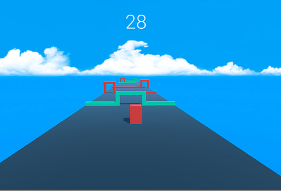
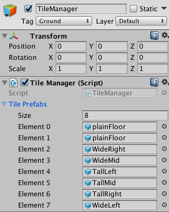
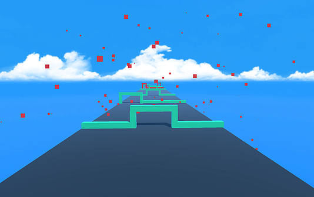
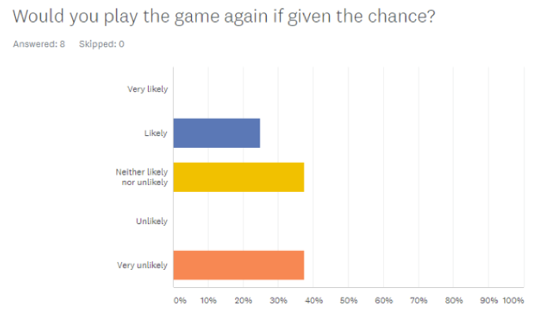
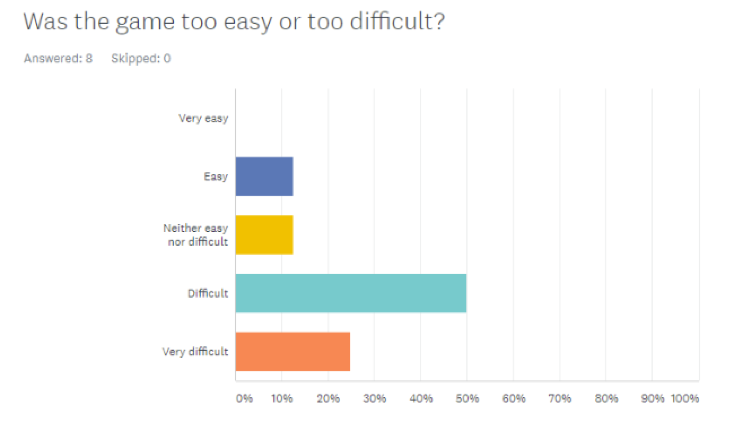

# ShapeShifter

## Description
ShapeShifter is a first-person infinite-runner game developed in Unity3D. The player is tasked with moving the character back and forth on the platform, using the space bar to change shapes in order to get through the respective gates. Score is based on time spent alive. 

## Technical Aspects 
Various implementation details include:
- `TileManager` class for procedural generation of the various game tiles based on the location of the character. This limits computational overhead and makes the game run faster. 
- Various physics aspects were handled explicitly using `Vector3` in combination with custom movement classes for the character `GameObject`. These include gravity, custom speed, and `Lerp`ing the camera movement to make it smoother.
- `AudioSource` gives buttons sound, plays a sound when the user successfully enters a gate, as well as a sound upon losing. 
- `SceneManager` to transition between the title screen, gameplay screen, game-over screen, and instructions screen.

## Images
|  |  |
|:---:|:---:|
| The two prefabs always match location | The main game screen |

|  |  |
|:---:|:---:|
| The TileManager script cycles through these platform prefabs | The character explodes when the player loses |

## Developement
Our group utilized Unity as the game buiding platform. Unity Collaborate allowed remote development between all group members, as well as version control. MonoDevelop was used for C# development. 

## Challenges
Having two `GameObjects` represent our character was challenging. We had to figure out how to make two objects move in sync. This was accomplished by enabling/disabling the Mesh Renderer depending on which character was shown. If not for this, each shape would constantly hit the other shape's respective gate. 

Along with this, the camera movement had to be synchronized with both of the shapes, as one was constantly being disabled when the other was enabled. To solve this problem we had to create an empty game object, with the two shapes in the hierarchy. Therefore, we could attach the camera to the parent object.

## Feedback 
|  |  |
|:---:|:---:|
Near the end of the development cycle, our surveys indicated that users were not happy with the game. We attributed this to the difficulty and speed of the gameplay. We were not taking into account what other people wanted to see in our game and focused too much on what we thought was fun. 

Taking into account verbal feedback, we added an easy and hard mode to the game, giving players of different skill levels the ability to enjoy the game.